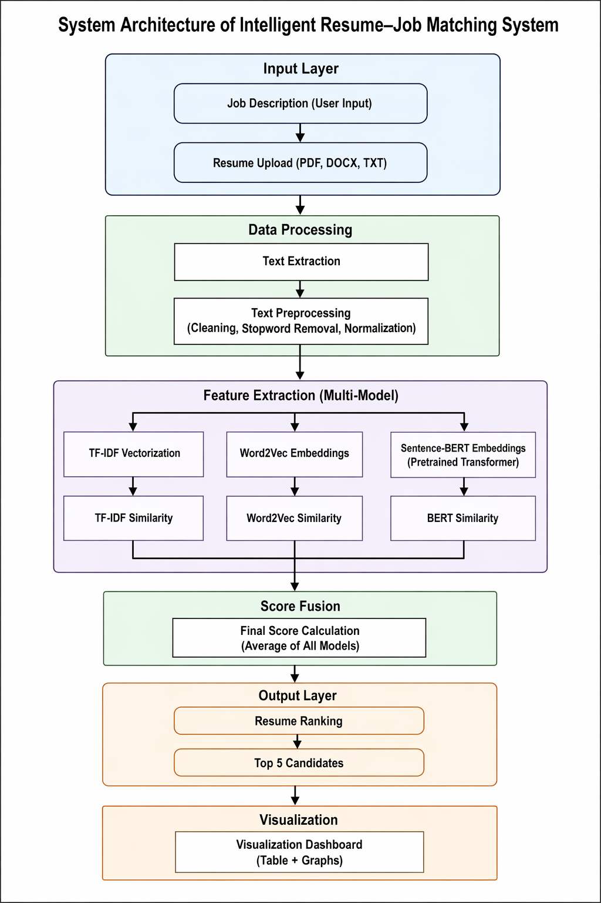
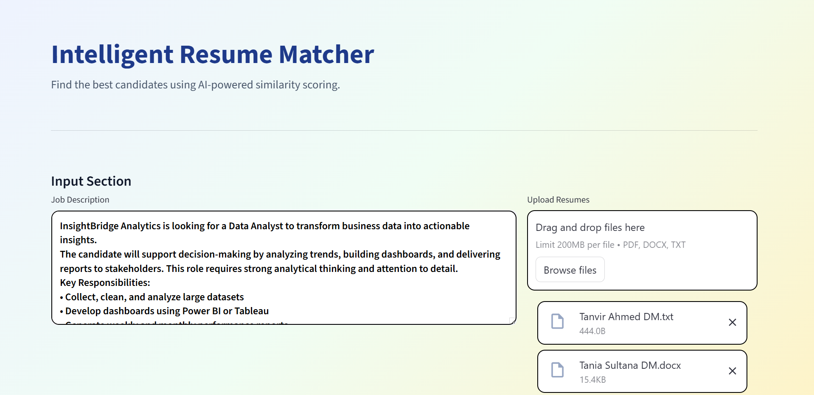
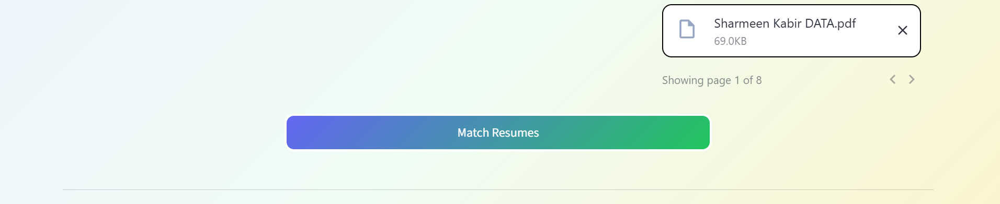
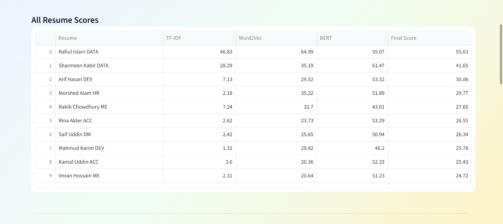
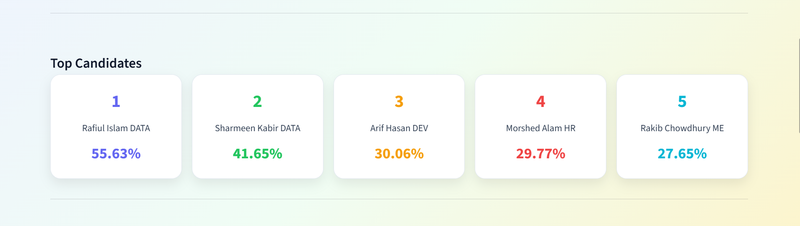
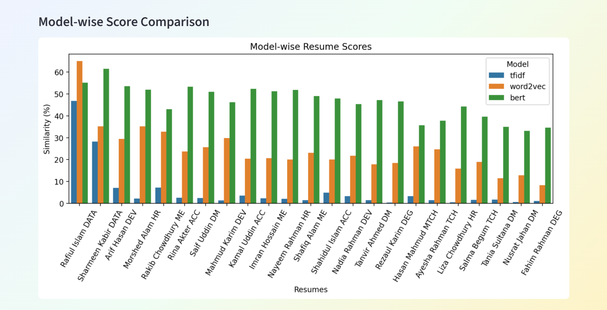
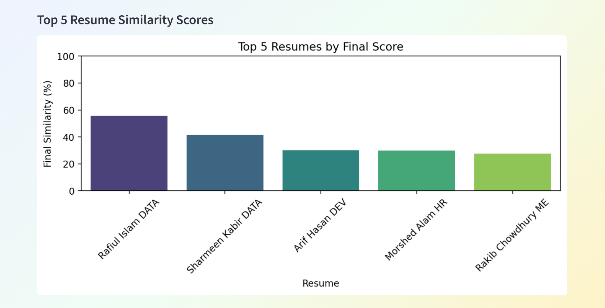

<h1 align="center">Intelligent Resume–Job Matching System</h1>

<p align="center">
AI-powered Resume Screening using NLP & Multi-Model Semantic Similarity
</p>

<p align="center">


</p>

---

## 📌 Overview

This project is a **Machine Learning and NLP-based application** that automates resume screening by matching candidate resumes with a given job description.

Unlike traditional keyword-based systems, this solution leverages **semantic similarity techniques** to understand contextual meaning and provide more accurate candidate ranking.

---

## 💡 Why This Project?

Manual resume screening is:

* Time-consuming
* Inconsistent
* Limited to keyword matching

This system improves the process by:

* Understanding contextual meaning (semantic similarity)
* Using multiple models for better accuracy
* Providing ranked results automatically

---

## 🚀 Features

* 📥 Upload multiple resumes (PDF, DOCX, TXT)
* 📝 Enter job description
* 🔍 Automatic text extraction & preprocessing
* 🤖 Multi-model similarity:

  * TF-IDF
  * Word2Vec
  * Sentence-BERT
* 📊 Final combined scoring system
* 🏆 Top 5 candidate selection
* 📈 Interactive visualizations
* 🎨 Clean and modern UI

---

## 🧠 System Workflow

1. Input job description
2. Upload multiple resumes
3. Extract text from files
4. Apply preprocessing (cleaning, normalization)
5. Generate features using:

   * TF-IDF
   * Word2Vec
   * Sentence-BERT
6. Compute similarity scores
7. Combine scores into final score
8. Rank resumes
9. Display results and visualizations

---

## 🏗️ System Architecture



---

## 📸 Screenshots

### 🏠 Home Page




### 📊 Results Table



### 🏆 Top 5 Candidates



### 📈 Graph Visualizations




---

## 🛠️ Tech Stack

### 💻 Programming Language

* Python

### ⚙️ Framework

* Streamlit

### 📚 Libraries

* pandas
* numpy
* scikit-learn
* nltk
* sentence-transformers
* gensim
* matplotlib
* seaborn
* PyPDF2
* docx2txt

---

## 📂 Project Structure

```bash
.
├── app.py          # Streamlit UI
├── model.py        # Model logic (TF-IDF, Word2Vec, BERT)
├── utils.py        # Text extraction & preprocessing
├── requirements.txt
├── README.md
└── screenshots/
    ├── Arch.png
    ├── HOME1.png
    ├── HOME2.png
    ├── RESULT.png
    ├── TOP5.png
    ├── LASTG.png
    └── MODELWISE.png

```

---

## ⚙️ Installation

```bash
git clone https://github.com/arsaimon00/Resume-Job-Matching-System.git
cd repo-name
pip install -r requirements.txt
```

---

## ▶️ How to Run

```bash
streamlit run app.py
```

---

## 📊 Output

* 📋 Table showing similarity scores for all resumes
* 🏆 Top 5 ranked candidates
* 📈 Model-wise comparison graph
* 📊 Final score visualization

---

## 🧪 Sample Testing

You can test the system by:

* Providing your own job description
* Uploading multiple resumes

The system will automatically rank candidates based on relevance.

---

## 🚧 Future Improvements

* Advanced ranking techniques
* Skill extraction module
* Model fine-tuning
* Web deployment
* User authentication system

---

## 👥 Authors

* Taslima Binte Aziz
* Asrafur Rahman Saimon
* Srabonti Chy

---

## 📌 Conclusion

This project demonstrates how **Machine Learning and NLP techniques** can improve resume screening by using **semantic understanding and multi-model comparison**, resulting in more accurate and efficient candidate selection.

---

⭐ If you found this project useful, consider giving it a star!
